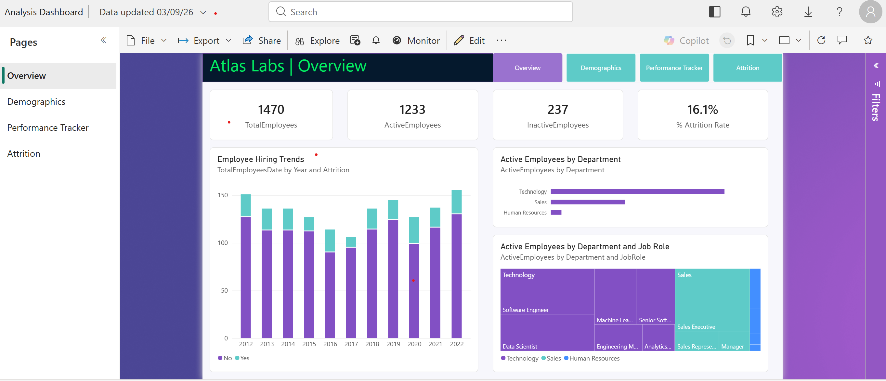
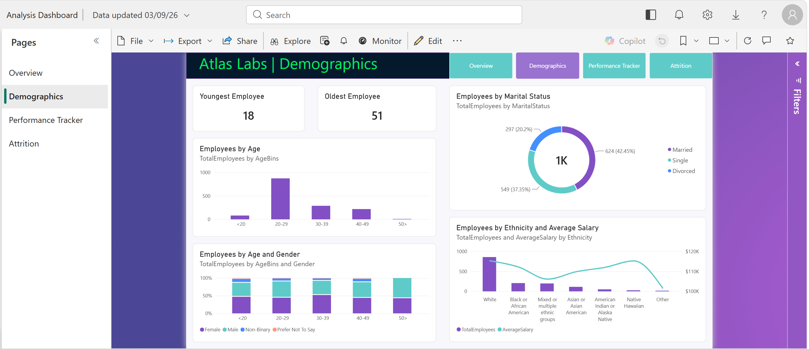
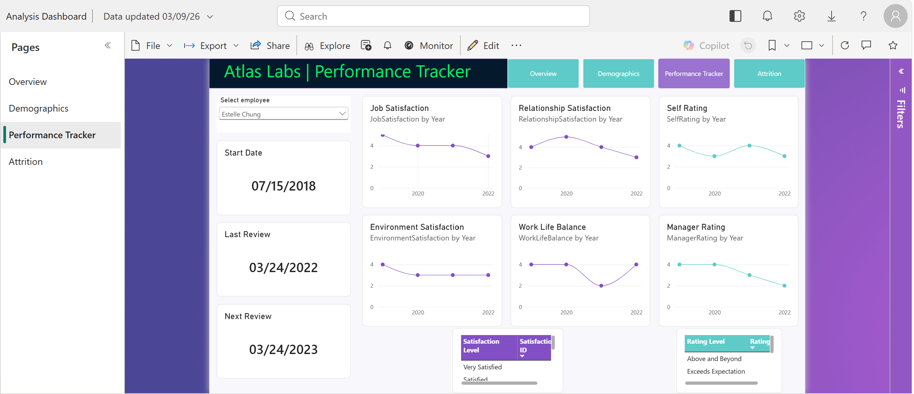
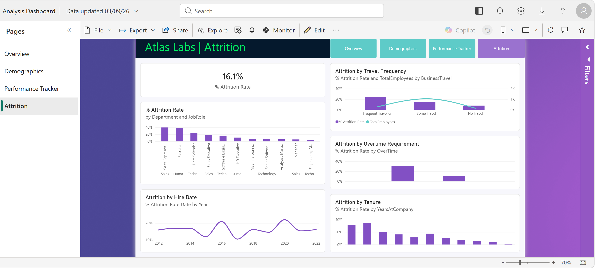

# HR Analytics Dashboard | Power BI

## Project Overview

This project presents an interactive HR Analytics dashboard built in Power BI for Atlas Labs.

The dashboard is designed to help HR teams explore workforce composition, employee performance, and employee attrition. It combines key HR metrics with interactive visualizations to identify workforce trends and potential areas of concern.

## Dashboard Preview

### Overview

The Overview page provides a high-level view of the workforce, including total employees, active employees, inactive employees, and the overall attrition rate. It also shows hiring trends and employee distribution across departments and job roles.

### Demographics

The Demographics page explores the composition of the workforce by age, gender, marital status, ethnicity, and salary.

### Performance Tracker

The Performance Tracker allows users to select an individual employee and review their performance-related metrics over time, including:

- Job satisfaction
- Relationship satisfaction
- Self rating
- Environment satisfaction
- Work-life balance
- Manager rating

It also provides information about the employee's start date, previous review, and next scheduled review.

### Attrition

The Attrition page focuses on employee turnover and examines attrition rates across different dimensions, including:

- Department and job role
- Business travel frequency
- Overtime requirements
- Hire date
- Years at the company

## Key Metrics

The dashboard provides an overview of:

| Metric | Value |
|---|---:|
| Total Employees | 1,470 |
| Active Employees | 1,233 |
| Inactive Employees | 237 |
| Attrition Rate | 16.1% |

## Key Insights

### Workforce Composition

- The majority of employees are between **20 and 29 years old**.
- Technology is the largest department by active employee count, followed by Sales and Human Resources.
- Software Engineers and Data Scientists represent some of the largest job-role groups within the Technology department.

### Employee Demographics

- The workforce includes employees across a broad range of age groups, with employees aged 20–29 representing the largest group.
- The dashboard provides a breakdown of employees by marital status, gender, and ethnicity alongside average salary.

### Employee Performance

- The Performance Tracker enables HR teams to investigate individual employee satisfaction and performance trends over time.
- Multiple indicators can be reviewed together, including job satisfaction, relationship satisfaction, environment satisfaction, work-life balance, self-rating, and manager rating.

### Employee Attrition

- The overall attrition rate is **16.1%**.
- Attrition varies considerably across job roles and departments.
- The dashboard shows higher attrition among some shorter-tenure employee groups, suggesting that employee retention may be particularly important during the early stages of employment.
- Attrition also varies depending on business travel frequency and overtime requirements.

## Tools & Skills

- **Power BI**
- **DAX**
- **Power Query**
- **Data Modeling**
- **Data Visualization**
- **HR Analytics**
- **Business Analysis**

## Project Features

- Interactive dashboard navigation
- KPI cards
- Interactive employee selection
- Time-series analysis
- Department and job-role analysis
- Demographic analysis
- Attrition analysis
- Performance tracking
- Data visualization and storytelling

## Project Files

- `Analysis Dashboard.pbix` – Power BI report containing the interactive dashboard.
- `screenshots/` – Dashboard screenshots for each report page.

## Data Source

This project was completed as part of a DataCamp case study.

## Disclaimer

This project is intended for educational and portfolio purposes.
